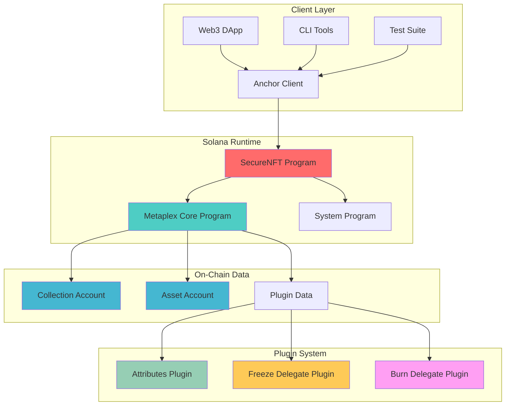
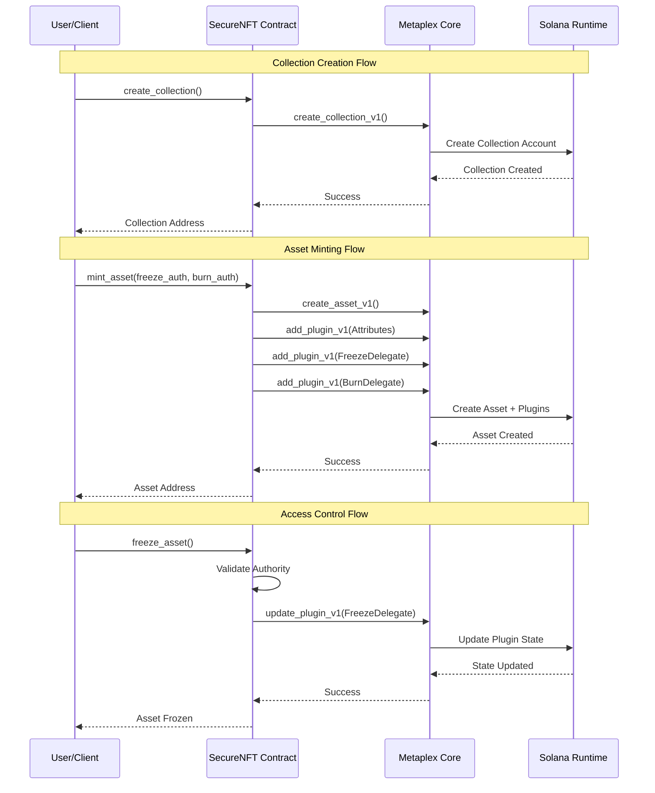
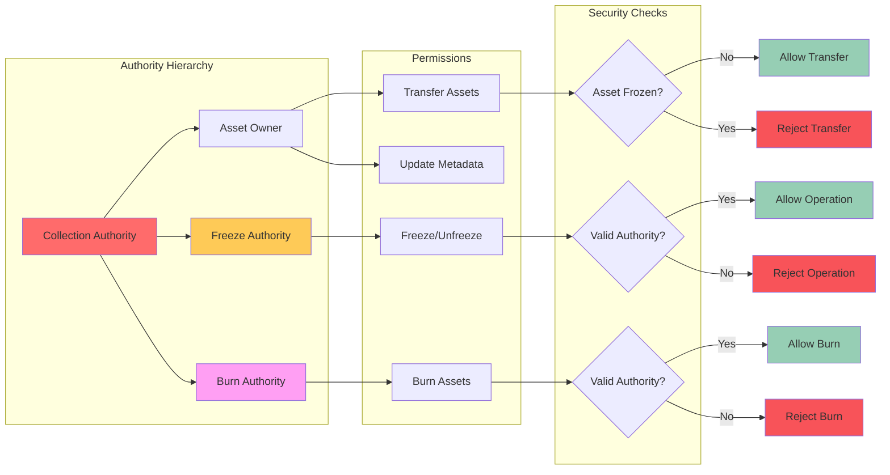

# 🛡️ SecureNFT - Advanced NFT Access Control Protocol

**SecureNFT** is a comprehensive Solana smart contract built with Anchor and Metaplex Core that provides advanced access control features for NFT collections and assets. It offers freeze protection, burn protection, and transfer controls to give creators and owners granular control over their digital assets.

## 🌟 Features

### Core Functionality
- ✅ **NFT Collection Creation** - Create organized collections for your NFTs
- ✅ **NFT Asset Minting** - Mint individual NFTs with custom attributes
- ✅ **Access Control System** - Advanced permission-based controls

### Advanced Access Controls
- 🔒 **Freeze Protection** - Temporarily lock assets to prevent transfers
- 🔥 **Burn Protection** - Control who can destroy assets  
- 📤 **Transfer Controls** - Manage asset ownership changes
- 👑 **Authority Management** - Granular permission system

### Security Features
- 🛡️ **Authority Validation** - Only authorized users can perform privileged operations
- 🚫 **Unauthorized Access Prevention** - Built-in security checks
- 🔐 **Plugin-Based Architecture** - Leverages Metaplex Core's plugin system

## 🏗️ Architecture

### System Overview



### Data Flow Architecture



### Smart Contract Structure
```
SecureNFT Contract
├── Collection Management
│   └── create_collection() - Create NFT collections
├── Asset Management  
│   ├── mint_asset() - Mint NFTs with access controls
│   └── transfer_asset() - Transfer asset ownership
└── Access Controls
    ├── freeze_asset() - Lock assets from transfers
    ├── unfreeze_asset() - Unlock assets for transfers
    └── burn_asset() - Destroy assets (authorized only)
```

### Authority & Permission Model



### Key Components

#### 1. **Collection Creation** (`mint_collection.rs`)
- Creates organizational containers for NFTs
- Sets up collection-level metadata and authorities
- Integrates with Metaplex Core for standard compliance

#### 2. **Asset Minting** (`mint_asset.rs`) 
- Mints individual NFTs with custom attributes
- Implements freeze and burn protection plugins
- Configurable authority assignment

#### 3. **Freeze Controls** (`freeze_asset.rs`)
- Temporarily locks assets to prevent transfers
- Useful for upgrades, maintenance, or disputes
- Reversible by designated freeze authority

#### 4. **Burn Protection** (`burn_asset.rs`)
- Controls asset destruction permissions
- Prevents unauthorized burning of valuable assets
- Only designated burn authority can destroy assets

#### 5. **Transfer System** (`transfer_asset.rs`)
- Manages asset ownership changes
- Respects freeze status (frozen assets cannot be transferred)
- Secure ownership validation

## 🚀 Getting Started

### Prerequisites
- **Node.js** (v16 or higher)
- **Rust** (latest stable)
- **Solana CLI** (v1.14+)
- **Anchor Framework** (v0.30+)

### Installation

1. **Clone the repository**
   ```bash
   git clone <repository-url>
   cd metaplex-track
   ```

2. **Install dependencies**
   ```bash
   npm install
   # or
   yarn install
   ```

3. **Build the program**
   ```bash
   anchor build
   ```

4. **Run tests**
   ```bash
   anchor test
   ```

### Configuration

1. **Set up your wallet**
   ```bash
   solana-keygen new --outfile ~/.config/solana/id.json
   ```

2. **Configure Solana cluster**
   ```bash
   # For development (devnet)
   solana config set --url https://api.devnet.solana.com
   
   # For production (mainnet-beta)
   solana config set --url https://api.mainnet-beta.solana.com
   ```

3. **Update Anchor.toml**
   ```toml
   [provider]
   cluster = "Devnet"  # or "Mainnet" for production
   wallet = "~/.config/solana/id.json"
   ```

## 📋 Usage Examples

### 1. Creating a Collection

```typescript
const collection = Keypair.generate();

const tx = await program.methods
  .createCollection()
  .accountsPartial({
    user: provider.publicKey,
    collection: collection.publicKey,
    authority: authorityPDA,
    systemProgram: SYSTEM_PROGRAM_ID,
    mplCoreProgram: MPL_CORE_PROGRAM_ID,
  })
  .signers([collection])
  .rpc();
```

### 2. Minting an Asset with Access Controls

```typescript
const asset = Keypair.generate();
const freezeAuthority = Keypair.generate();
const burnAuthority = Keypair.generate();

const tx = await program.methods
  .mintAsset(
    freezeAuthority.publicKey,  // Who can freeze/unfreeze
    burnAuthority.publicKey     // Who can burn the asset
  )
  .accountsPartial({
    user: provider.publicKey,
    mint: asset.publicKey,
    collection: collection.publicKey,
    authority: authorityPDA,
    systemProgram: SYSTEM_PROGRAM_ID,
    mplCoreProgram: MPL_CORE_PROGRAM_ID,
  })
  .signers([asset])
  .rpc();
```

### 3. Freezing an Asset

```typescript
const tx = await program.methods
  .freezeAsset()
  .accountsPartial({
    user: provider.publicKey,
    freezeAuthority: freezeAuthority.publicKey,
    asset: asset.publicKey,
    collection: collection.publicKey,
    systemProgram: SYSTEM_PROGRAM_ID,
    mplCoreProgram: MPL_CORE_PROGRAM_ID,
  })
  .signers([freezeAuthority])
  .rpc();
```

### 4. Transferring an Asset

```typescript
const newOwner = Keypair.generate();

const tx = await program.methods
  .transferAsset()
  .accountsPartial({
    currentOwner: currentOwner.publicKey,
    newOwner: newOwner.publicKey,
    asset: asset.publicKey,
    collection: collection.publicKey,
    systemProgram: SYSTEM_PROGRAM_ID,
    mplCoreProgram: MPL_CORE_PROGRAM_ID,
  })
  .signers([currentOwner])
  .rpc();
```

## 🧪 Testing

The project includes comprehensive tests covering all functionality:

### Test Categories

1. **Basic Functionality Tests**
   - Collection creation
   - Asset minting
   - Asset fetching

2. **Access Control Tests**
   - Freeze/unfreeze functionality
   - Unauthorized access prevention
   - Authority validation

3. **Burn Protection Tests**
   - Authorized vs unauthorized burning
   - Burn authority validation

4. **Transfer Tests**
   - Normal transfers
   - Frozen asset transfer prevention
   - Ownership validation

### Running Tests

```bash
# Run all tests
anchor test

# Run tests without local validator (using devnet)
anchor test --skip-local-validator

# Run specific test file
anchor test --skip-local-validator tests/metaplex-track.ts
```

## 🔧 Development

### Project Structure

```
metaplex-track/
├── programs/
│   └── metaplex-track/
│       └── src/
│           ├── lib.rs                 # Main program entry
│           └── instructions/
│               ├── mod.rs             # Module declarations
│               ├── mint_collection.rs # Collection creation
│               ├── mint_asset.rs      # Asset minting
│               ├── freeze_asset.rs    # Freeze controls
│               ├── burn_asset.rs      # Burn protection
│               └── transfer_asset.rs  # Transfer system
├── tests/
│   └── metaplex-track.ts             # Comprehensive tests
├── target/
│   ├── deploy/                       # Compiled programs
│   ├── idl/                         # Interface definitions
│   └── types/                       # TypeScript types
├── Anchor.toml                      # Anchor configuration
├── Cargo.toml                       # Rust dependencies
└── package.json                     # Node.js dependencies
```


## 📦 Dependencies

### Rust (Cargo.toml)

| Package         | Version   | Description                        |
|-----------------|-----------|------------------------------------|
| anchor-lang     | 0.31.1    | Solana program framework           |
| anchor-spl      | 0.31.1    | SPL token integration              |
| mpl-core        | 0.10.1    | Metaplex Core for NFT standards    |


## 🛡️ Security Considerations

### Access Control Model
- **Freeze Authority**: Can freeze/unfreeze specific assets
- **Burn Authority**: Can burn/destroy specific assets  
- **Collection Authority**: Controls collection-level operations
- **Asset Owner**: Can transfer assets (when not frozen)

### Security Features
- ✅ Authority validation on all privileged operations
- ✅ Frozen assets cannot be transferred
- ✅ Only designated authorities can burn assets
- ✅ Cross-program invocation protection
- ✅ Account ownership verification

### Best Practices
1. **Authority Separation**: Use different keys for different authorities
2. **Multi-sig for Critical Operations**: Consider multi-signature wallets for important authorities
3. **Regular Security Audits**: Review and audit the code regularly
4. **Test Thoroughly**: Comprehensive testing before mainnet deployment

## 🌐 Deployment

### Devnet Deployment
```bash
# Build and deploy to devnet
anchor build
anchor deploy --provider.cluster devnet
```

### Mainnet Deployment
```bash
# Switch to mainnet
solana config set --url https://api.mainnet-beta.solana.com

# Deploy to mainnet (ensure you have sufficient SOL)
anchor deploy --provider.cluster mainnet-beta
```

### Verification
After deployment, verify your program:
```bash
# Check program deployment
solana program show <PROGRAM_ID>

# Verify account creation
solana account <ACCOUNT_ADDRESS>
```

## 🤝 Contributing

1. Fork the repository
2. Create a feature branch (`git checkout -b feature/amazing-feature`)
3. Commit your changes (`git commit -m 'Add amazing feature'`)
4. Push to the branch (`git push origin feature/amazing-feature`)
5. Open a Pull Request

### Development Guidelines
- Follow Rust and TypeScript best practices
- Add comprehensive tests for new features
- Update documentation for any API changes
- Ensure all tests pass before submitting

## 📄 License

This project is licensed under the MIT License - see the [LICENSE](LICENSE) file for details.

## 🔗 Links

- **Solana Documentation**: https://docs.solana.com/
- **Anchor Framework**: https://www.anchor-lang.com/
- **Metaplex Core**: https://developers.metaplex.com/core
- **Metaplex Documentation**: https://developers.metaplex.com/

## 📞 Support

For questions, issues, or support:
- Open an issue on GitHub
- Join our Discord community
- Check the documentation

---

**SecureNFT** - Empowering creators with advanced NFT access control on Solana 🚀
